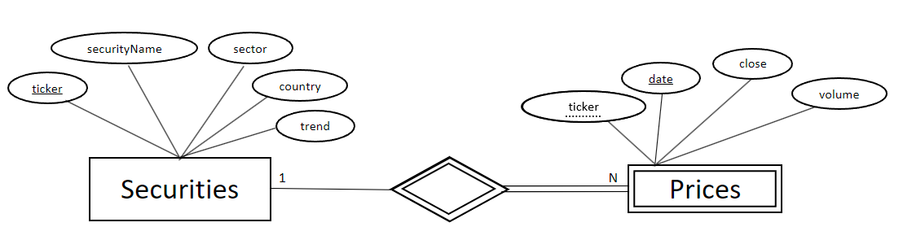

# Engine-AI-Challenge

## Introduction
### Backend_Server
Develope a Node.js/Typescript GraphQL API backend by a PostgreSQL instance that exposes the following data:

- Security List - an endpoint providing a list of available securities (companies) with some overview data;
- Security Detail - an endpoint providing all the fields related to a Security (company) including daily time-series values (close price, volume)

### Frontend_Server
Using Material UI (https://material-ui.com/) and Highcharts (https://github.com/highcharts/highcharts-react / https://www.highcharts.com/)
Create a React.js Single Page Application application with 2 screens:
- Security List:
    - A list of all securities provided in data.json displayed in a table with clickable rows
        - path:
            - /
            - /securities
        - Table fields:
            - symbol/ticker
            - name
            - sector
            - country
            - trend
                - Background
                    - 100, -20: Red
                    - -20, 20: Green
                    - 20-100: Blue
- Security Detail
    - A detail of a Security displayed after clicking on a row in the Security List screen
        - path:
            - /securities/:symbol
        - Detail fields:
            - Symbol
            - Name
            - Country
            - Sector
        - Chart fields:
            - close (price)
            - volume
            - date

## Solution Architecture/Development 

## Project Setup
### Backend_ServerTS (TypeScript) &  Backend_Server (JavaScript)

Two versions were developed. One in node.js with TypeScript and another similar one with JavaScript.

Before starting this project, you must configure the environment variables. Create a .env file with the variables:
- POSTGRES_USER
- POSTGRES_PASSWORD
- POSTGRES_DB
- POSTGRES_HOST

Execute the commands in the project command line:
- npm install
- npm start

Database configuration, table creation and data insertion will be performed automatically. If everything goes well, the following messages should return on the command line:

[nodemon] starting `node server.js`

Connection to postgres has been established successfully.

Server running on port 9000

GraphQL endpoint: http://localhost:9000/graphql

#### tables architecture:

### Frontend

Execute the commands in the project command line:
- npm install
- npm start